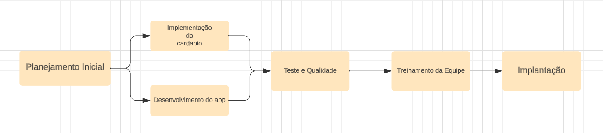

# Especificações do Projeto

Pré-requisitos: <a href="1-Documentação de Contexto.md"> Documentação de Contexto</a>

Definição do problema e ideia de solução a partir da perspectiva do usuário. É composta pela definição do  diagrama de personas, histórias de usuários, requisitos funcionais e não funcionais além das restrições do projeto.

Apresente uma visão geral do que será abordado nesta parte do documento, enumerando as técnicas e/ou ferramentas utilizadas para realizar a especificações do projeto

## Personas

### Persona 1

- Nome: Ana Santos

- Idade: 28 anos

- Área de Ocupação: Garçonete

- Gostos: Gosta de eficiência e organização. Aprecia aplicativos intuitivos que facilitem a tomada de pedidos e a comunicação com a cozinha. Gosta de ter todas as informações dos pratos, ingredientes e promoções facilmente acessíveis.

- Frustrações: Fica frustrada quando um aplicativo é lento ou difícil de navegar. Também se incomoda com falta de clareza nas descrições dos pratos e com problemas de comunicação que levam a erros nos pedidos.

### Persona 2

- Nome: João Silva
  
- Idade: 35 anos
  
- Área de Ocupação: Chef de Cozinha
  
- Gostos: Valoriza a precisão e rapidez na comunicação dos pedidos. Gosta de aplicativos que permitam personalizar os pedidos de acordo com as preferências dos clientes. Aprecia ferramentas que auxiliem no controle de estoque e reabastecimento de ingredientes.
  
- Frustrações: Fica frustrado quando os pedidos não chegam de maneira clara e completa. Também se incomoda com aplicativos que não atualizam o estoque corretamente, levando a problemas de disponibilidade de ingredientes.

### Persona 3

- Nome: Rafael Lima

- Idade: 28 anos

- Área de Ocupação: Cozinheiro

- Gostos: Rafael é um especialista em pizzas apaixonado por oferecer aos clientes experiências excepcionais de degustação. Ele gosta de estudar a fundo as características das pizzas e harmonizá-las com diferentes pratos. Fora do trabalho, gosta de visitar outras pizzarias e expandir seu conhecimento sobre elas.

- Frustrações com Apps para Restaurante: Rafael fica frustrado quando os aplicativos de menu da pizzaria não é atualizado com frequência. Ele quer ter acesso a uma lista de pizzas bem organizada, com informações detalhadas sobre cada pizza.

> **Links Úteis**:
> - [Rock Content](https://rockcontent.com/blog/personas/)
> - [Hotmart](https://blog.hotmart.com/pt-br/como-criar-persona-negocio/)
> - [O que é persona?](https://resultadosdigitais.com.br/blog/persona-o-que-e/)
> - [Persona x Público-alvo](https://flammo.com.br/blog/persona-e-publico-alvo-qual-a-diferenca/)
> - [Mapa de Empatia](https://resultadosdigitais.com.br/blog/mapa-da-empatia/)
> - [Mapa de Stalkeholders](https://www.racecomunicacao.com.br/blog/como-fazer-o-mapeamento-de-stakeholders/)

## Histórias de Usuários

Com base na análise das personas foram identificadas as seguintes histórias de usuários:

|EU COMO... `PERSONA`| QUERO/PRECISO ... `FUNCIONALIDADE` |PARA ... `MOTIVO/VALOR`                 |
|--------------------|------------------------------------|----------------------------------------|
| Rafael Lima | O app deve encaminhar o cliente ao cardápio ao ser acessado | A apresentação do cardápio ao ser acessado é uma vital, pois oferece aos clientes uma visão completa e detalhada das opções de comida disponíveis no restaurante.|
| Rafael Lima | Pode se ter um mecanismo de busca | A busca de itens no cardápio é essencial para proporcionar aos clientes uma experiência eficiente e conveniente ao explorar as opções disponíveis.|
| Ana Santos | O cliente deve fazer pedidos pelo app | Essa funcionalidade é o cerne da aplicação, pois permite aos clientes realizar pedidos de forma rápida e conveniente através do aplicativo. |
| Ana Santos | O app poderia mostrar o status do pedido ao cliente | A capacidade de os clientes visualizarem o status do pedido é fundamental para fornecer transparência e tranquilidade durante a espera pelo pedido. |
| Ana Santos | Como garçonete, me ajudaria bastante poder visualizar os pedidos pelo app| Permitir que os funcionários visualizem os pedidos é fundamental para otimizar as operações internas do restaurante.|
| Ana Santos | Para ajudar na organização dos pedidos, seria interessante um filtro sobre o status dos pedidos|A filtragem dos pedidos por status é essencial para otimizar a gestão interna dos pedidos e garantir um fluxo de trabalho mais organizado. |
| Rafael Lima | A cozinha deve ser capaz de alterar o status dos pedidos |A alteração do status dos pedidos é crucial para acompanhar e gerenciar o progresso de cada pedido de forma eficaz.|
| João Silva | O app deve conter funções exclusivas a funcionários, então deve haver um sistema de registro dos mesmos | A funcionalidade de permitir que os funcionários façam login no aplicativo é fundamental para garantir a segurança dos dados e a autenticação das ações realizadas pelos membros da equipe. Ao fornecer um sistema de login exclusivo para os funcionários, o restaurante pode controlar quem tem acesso às informações e funcionalidades exclusivas do restaurante.|
| João Silva | Gostamos de inovar e trazer novas pizzas aos nossos clientes, então é necessário uma função que nos permita adicionar novos pratos | Permitir que os funcionários adicionem itens ao cardápio é importante para manter o menu atualizado e adaptado às mudanças nas ofertas do restaurante. |
| João Silva | Para que os clientes saibam quais pratos estão disponíveis, precisamos de um sistema que coloque o status do prato |Permitir que os funcionários alterem o status de um item no cardápio é essencial para manter as informações precisas e atualizadas para os clientes. |
| João Silva | Sempre haverão pratos que não chamam tanta atenção, caso isso aconteça, devemos ser capazes de retirá-los do cardápio |Permitir que os funcionários retirem itens do cardápio é fundamental para manter um menu atualizado e relevante para os clientes. |
|João Silva| Os preços dos ingredientes sempre estão mudando, o que nos obriga também a mudar o valor de nossas pizzas e os clientes precisam ver isso no cardápio |A funcionalidade de permitir que os funcionários alterem o valor de um item no cardápio é importante para manter os preços atualizados e precisos para os clientes. |

> **Links Úteis**:
> - [Histórias de usuários com exemplos e template](https://www.atlassian.com/br/agile/project-management/user-stories)
> - [Como escrever boas histórias de usuário (User Stories)](https://medium.com/vertice/como-escrever-boas-users-stories-hist%C3%B3rias-de-usu%C3%A1rios-b29c75043fac)
> - [User Stories: requisitos que humanos entendem](https://www.luiztools.com.br/post/user-stories-descricao-de-requisitos-que-humanos-entendem/)
> - [Histórias de Usuários: mais exemplos](https://www.reqview.com/doc/user-stories-example.html)
> - [9 Common User Story Mistakes](https://airfocus.com/blog/user-story-mistakes/)

## Modelagem do Processo de Negócio 

### Análise da Situação Atual

Apresente aqui os problemas existentes que viabilizam sua proposta. Apresente o modelo do sistema como ele funciona hoje. Caso sua proposta seja inovadora e não existam processos claramente definidos, apresente como as tarefas que o seu sistema pretende implementar são executadas atualmente, mesmo que não se utilize tecnologia computacional. 

### Descrição Geral da Proposta

Apresente aqui uma descrição da sua proposta abordando seus limites e suas ligações com as estratégias e objetivos do negócio. Apresente aqui as oportunidades de melhorias.

### Processo 1 – NOME DO PROCESSO

Apresente aqui o nome e as oportunidades de melhorias para o processo 1. Em seguida, apresente o modelo do processo 1, descrito no padrão BPMN. 

### Processo 2 – NOME DO PROCESSO

Apresente aqui o nome e as oportunidades de melhorias para o processo 2. Em seguida, apresente o modelo do processo 2, descrito no padrão BPMN.

## Indicadores de Desempenho

Apresente aqui os principais indicadores de desempenho e algumas metas para o processo. Atenção: as informações necessárias para gerar os indicadores devem estar contempladas no diagrama de classe. Colocar no mínimo 5 indicadores. 

|Indicador| Objetivos | Descrição |  Cálculo | Fonte dados | Perspectiva |
|-----------|------|------|----------------|----------------|---------|
|Tempo oscilação de desempenho| Avaliar se o sistema oscila quando há muitas requisições simultâneas | Verificar se há alteração no tempo médio das funções quando há requisições simultâneas | | Tabela de testes de tempo | Atestar a eficiência do sistema em sua máxima utilização|
|Média de tempo de visualização de item | Avaliar o tempo de visualização de itens no cardápio |Quantificar o tempo demorado entre o clique num item no cardápio e sua visualização | | Tabela de teste de tempo |Melhoria da velocidade da visualização de itens |
|Tempo que o pedido leva para chegar à cozinha| Verificar se há eficiência no tempo dos pedidos | Quantificar o tempo demorado entre o pedido do cliente e seu aparecimento para os funcionários| | Tabela de teste des tempo | Atestar a eficiência da função de pedidos|
|Tempo levado pela alteração de status de pedidos| Verificar se há eficiência na alteração de status dos pedidos | Quantificar o tempo médio das alterações de status dos pedidos | | Tabela de testes de tempo | Atestar a eficiência da função de alteração de status de pedido|
|Média de clientes atendidos por dia| Quantificar a quantidade de clientes (e não de pedidos) | Verificar quantos clientes frequentam a pizzaria diariamente | | Tabela de testes de tempo | Quantificar o público do restaurante|

## Requisitos

As tabelas que se seguem apresentam os requisitos funcionais e não funcionais que detalham o escopo do projeto. Para determinar a prioridade de requisitos, aplicar uma técnica de priorização de requisitos e detalhar como a técnica foi aplicada.

### Requisitos Funcionais

|ID    | Descrição do Requisito  | Prioridade |
|------|-----------------------------------------|----|
|RF-001| O app deve apresentar o cardápio ao ser acessado | ALTA | 
|RF-002| Permitir que o cliente busque os itens do cardápio | MÉDIA | 
|RF-003| Permitir que o cliente faça um pedido | ALTA | 
|RF-004| Permitir que o cliente altere um pedido antes de submetê-lo ao restaurante | ALTA | 
|RF-005| Permitir que o cliente visualize o status do pedido | BAIXA | 
|RF-006| Permitir que o funcionario visualize os pedidos  | ALTA | 
|RF-007| Permitir que o funcionario filtre os pedidos por status   | MÉDIA | 
|RF-008| Permitir que o funcionario altere o status dos pedidos  | ALTA | 
|RF-009| Permitir que o funcionario faça login  | ALTA | 
|RF-010| Permitir que o funcionario adicione um item no cardápio  | ALTA | 
|RF-011| Permitir que o funcionario altere o status de um item no cardápio  | MÉDIA |
|RF-012| Permitir que o funcionario retire um item do cardápio  | ALTA | 
|RF-013| Permitir que o funcionario altere o valor de um item no cardápio  | MÉDIA | 

### Requisitos não Funcionais

|ID     | Descrição do Requisito  |Prioridade |
|------|------------------------|-------|
|RNF-001| O sistema deve ser responsivo para funcionar em um dispositivos móvel | ALTA | 
|RNF-002| O aplicativo deve ser publicado num ambiente acessível somente para os clientes e funcionários do restaurante. |  ALTA | 
|RNF-003| O sistema deve ser protegido contra acesso não autorizado. | ALTA | 
|RNF-004| O sistema deve processar requisições do usuário em no máximo 3s |  BAIXA | 
|RNF-005| O sistema deve ter bom nível de contraste entre os elementos da tela em conformidade. |  MÉDIA |
|RNF-006| O sistema deve permitir o acesso de múltiplos usuários sem sofrer qualquer degradação no desempenho. |  ALTA |

Com base nas Histórias de Usuário, enumere os requisitos da sua solução. Classifique esses requisitos em dois grupos:

- [Requisitos Funcionais
 (RF)](https://pt.wikipedia.org/wiki/Requisito_funcional):
 correspondem a uma funcionalidade que deve estar presente na
  plataforma (ex: cadastro de usuário).
- [Requisitos Não Funcionais
  (RNF)](https://pt.wikipedia.org/wiki/Requisito_n%C3%A3o_funcional):
  correspondem a uma característica técnica, seja de usabilidade,
  desempenho, confiabilidade, segurança ou outro (ex: suporte a
  dispositivos iOS e Android).
Lembre-se que cada requisito deve corresponder à uma e somente uma
característica alvo da sua solução. Além disso, certifique-se de que
todos os aspectos capturados nas Histórias de Usuário foram cobertos.

## Restrições

O projeto está restrito pelos itens apresentados na tabela a seguir.

|ID| Restrição                                             |
|--|-------------------------------------------------------|
|01| O projeto deverá ser entregue até o final do semestre |
|02| Não pode ser desenvolvido um módulo de backend        |

Enumere as restrições à sua solução. Lembre-se de que as restrições geralmente limitam a solução candidata.

> **Links Úteis**:
> - [O que são Requisitos Funcionais e Requisitos Não Funcionais?](https://codificar.com.br/requisitos-funcionais-nao-funcionais/)
> - [O que são requisitos funcionais e requisitos não funcionais?](https://analisederequisitos.com.br/requisitos-funcionais-e-requisitos-nao-funcionais-o-que-sao/)

## Diagrama de Casos de Uso

O diagrama de casos de uso é o próximo passo após a elicitação de requisitos, que utiliza um modelo gráfico e uma tabela com as descrições sucintas dos casos de uso e dos atores. Ele contempla a fronteira do sistema e o detalhamento dos requisitos funcionais com a indicação dos atores, casos de uso e seus relacionamentos. 

# Matriz de Rastreabilidade

|   | RF-001 | RF-002 | RF-003 | RF-004 | RF-005 | RF-006 | RF-007 | RF-008 | RF-009 | RF-010 | RF-011 | RF-012 | RF-013 | RNF-001 | RNF-002 | RNF-003 |RNF-004  | RNF-005 | RNF-006 | | 
|---|-----|---|---|---|---|---|---|---|---|---|---|---|---|---|---|---|---|-----|-----|---|
|RF-001|   |   |   |   |   |   |   |   |   |   |   |   |   |   |   |   |   |     |    |
|RF-002|   | x |   |   |   |   |   |   |   |   |   |   |   |   |   |   |   |     |    |
|RF-003|   | x | x |   |   |   |   |   |   |   |   |   |   |   |   |   |   |     |    |
|RF-004|   | x | x | x |   |   |   |   |   |   |   |   |   |   |   |   |   |     |    |
|RF-005|   | x | x | x | x |   |   |   |   |   |   |   |   |   |   |   |   |     |    |
|RF-006|   |   |   |   |   |   |   |   |   | x |   |   |   |   |   |   |   |     |    |
|RF-007|   |   |   |   |   |   | x |   |   | x |   |   |   |   |   |   |   |     |    |
|RF-008|   |   |   |   |   |   | x |   |   | x |   |   |   |   |   |   |   |     |    |
|RF-009|   |   |   |   |   |   |   |   |   |   |   |   |   |   |   |   |   |     |    |
|RF-010|   | x |   |   |   |   |   |   |   | x |   |   |   |   |   |   |   |     |    |
|RF-011|   | x |   |   |   |   |   |   |   | x |   |   |   |   |   |   |   |     |    |
|RF-012|   | x |   |   |   |   |   |   |   | x |   |   |   |   |   |   |   |     |    |
|RF-013|   | x |   |   |   |   |   |   |   | x |   |   |   |   |   |   |   |     |    |
|RNF-001|  | x |   |   |   |   |   |   |   |   |   |   |   | x |   |   |   |     |    |
|RNF-002|  | x |   |   |   |   | x |   |   | x |   |   |   |   | x |   | x |     |    |
|RNF-003|  | x |   |   |   |   |   |   |   | x |   |   |   |   | x | x |   |     |    |
|RNF-004|  |   | x | x | x | x |   |   |   |   |   |   |   |   |   |   |   |     |    |
|RNF-005|  | x | x |   |   |   | x |   |   |   |   |   |   |   | x |   |   |     |    |
|RNF-006|  |   |   |   |   |   |   |   |   |   |   |   |   |   |   |   | x |     |    |

# Gerenciamento de Projeto

De acordo com o PMBoK v6 as dez áreas que constituem os pilares para gerenciar projetos, e que caracterizam a multidisciplinaridade envolvida, são: Integração, Escopo, Cronograma (Tempo), Custos, Qualidade, Recursos, Comunicações, Riscos, Aquisições, Partes Interessadas. Para desenvolver projetos um profissional deve se preocupar em gerenciar todas essas dez áreas. Elas se complementam e se relacionam, de tal forma que não se deve apenas examinar uma área de forma estanque. É preciso considerar, por exemplo, que as áreas de Escopo, Cronograma e Custos estão muito relacionadas. Assim, se eu amplio o escopo de um projeto eu posso afetar seu cronograma e seus custos.

## Gerenciamento de Tempo

Apresentamos a análise PERT/CPM para o projeto de desenvolvimento do Pizzapp, um aplicativo de pedidos cujo podera ser feito por tablets implantados em cada mesa aonde os clientes irão realizar pedidos sem a nescessidade de atendimento humano para tirar o pedido.

A tabela a seguir detalha as atividades envolvidas no projeto, suas descrições, estimativas de tempo e as dependências entre elas:
|ATIVIDADE | DESCRIÇÃO DA ATIVIDADE    | TEMPO MAIS CURTO | TEMPO MAIS PROVÁVEL | TEMPO ESPERADO | PREDECESSORA |
|----------|---------------------------|------------------|---------------------|----------------|--------------|
| A        | Planejamento Inicial      |        5         |           7         |        5       |   não há     |
| B        | Desenvolvimento App       |        10        |           17        |        17      |     A        |
| C        | Implementação do Cardápio |        4         |           8         |        8       |     B        |
| D        | Testes e Qualidade        |        3         |           7         |        7       |     C        |
| E        | Treinamento da Equipe     |        2         |           3         |        2       |     D        |
| F        | Implantação               |        2         |           4         |        4       |     E        |

Análise:

- A atividade A, "Planejamento Inicial", é a primeira do projeto e não tem predecessora. Ela tem um tempo estimado de 5 dias.
- A atividade B, "Desenvolvimento App", depende da conclusão da atividade A. Suas estimativas de tempo variam de 10 a 17 dias.
- A atividade C, "Criação do Cardápio", depende do desenvolvimento do aplicativo (atividade B) e tem estimativas de tempo entre 4 e 8 dias.
- A atividade D, "Testes e Qualidade", depende da criação do cardápio (atividade C) e tem estimativas de tempo entre 3 e 7 - dias.
- A atividade E, "Treinamento da Equipe", depende dos testes e da qualidade (atividade D) e tem estimativas de tempo entre 2 e 3 dias.
- A atividade F, "Implantação", depende do Treinamento da Equipe (atividade E) e tem estimativas de tempo entre 2 e 4 dias.
- O caminho crítico do projeto é A → B → C → D → E, com um tempo total estimado de 43 dias. Isso significa que qualquer atraso nas atividades do caminho crítico afetará o cronograma geral do projeto.

## Gerenciamento de Equipe

# Desenvolvimento: 
> Equipe: Brendon, Iugor, Bruno

> - Papéis: 
> Brendon: Líder do Desenvolvimento
> Iugor e Bruno: Desenvolvedores

# Criação do Cardápio:
> Equipe: Ricardo, Dani, Eryc

> - Papéis:
> Ricardo: Líder de Criação de Cardápio
> Dani e Eryc: Designers e Criadores de Conteúdo

## Gestão de Orçamento

Desenvolvimento do Aplicativo: R$18.600
Testes e Qualidade: R$4.500
Revisão e Aprovação: R$2.000

- Custos de Hardware:
Tablets: R$9.000 (para compra de tablets)
Infraestrutura de Redes e Conectividade: R$2.500

- Treinamento:
Treinamento da Equipe: R$1.500

- Custos de Materiais:
Materiais de Marketing (para lançamento do cardápio): R$800

- Custos de Gerenciamento de Projeto:
Gerente de Projeto: R$7.500 (considerando um valor mensal para a duração do projeto)

- Outros Custos:
Reserva para Custos Imprevistos: R$4.000

Total Estimado: R$50.400
